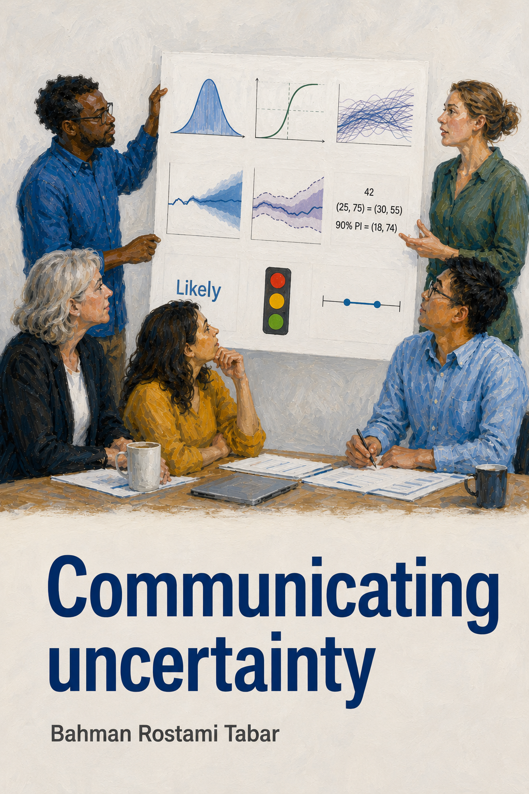

::: {.content-visible when-format="html"}
{fig-align="center" width="50%" style="border-radius: 8px; box-shadow: 0 4px 20px rgba(0,0,0,0.15);"}
:::

# Welcome {.unnumbered}

This is the online home of **Communicating Uncertainty: A Comprehensive Guide
Across Disciplines**, authored by
[Bahman Rostami-Tabar](https://bahmanrostamitabar.com/).

Uncertainty is an inescapable feature of knowledge and decision-making in
virtually every domain of human endeavour — from medicine and meteorology to
economics, public health, and engineering. Yet despite its ubiquity,
uncertainty is frequently hidden, oversimplified, or communicated in ways that
mislead the very audiences who need honest information to make good decisions.

This book addresses that gap. It provides a practical, cross-disciplinary
reference for anyone who needs to communicate uncertainty — whether in a
scientific report, a policy document, a public health bulletin, a data
visualisation, or a financial forecast. It draws on literature spanning
statistics, psychology, climate science, economics, intelligence analysis,
ecology, and risk communication.

## What This Book Covers {.unnumbered}

The book is organised in three parts:

**Part I — Foundations** introduces the conceptual landscape. It defines
uncertainty and its key frameworks (including the epistemic–aleatory
distinction and Stirling's incertitude matrix), examines the sources from
which uncertainty arises, and situates uncertainty among closely related
concepts — variability, volatility, randomness, and risk.

**Part II — Why and To Whom** addresses the fundamental question of whether
and why uncertainty should be communicated at all. It documents the
consequences of failing to communicate honestly, and provides a structured
typology of audiences — from the general public to domain experts — and what
each type of user needs.

**Part III — Methods** forms the core of the book. Eight distinct methods for
communicating uncertainty are reviewed in depth:

| Method | Section |
|--------|---------|
| Forecast Trajectories (spaghetti plots) | @sec-trajectories |
| Fan Charts | @sec-fan-charts |
| Probability Distributions | @sec-distributions |
| Prediction Intervals and Quantiles | @sec-intervals |
| Categorical Approaches (e.g., RAG) | @sec-categorical |
| Scenario and What-If Analysis | @sec-scenarios |
| Verbal Expressions | @sec-verbal |
| Numerical Expressions | @sec-numerical |

For each method the book covers: what it is, a practical example with a
figure, strengths and limitations, when to use it, and good practice
recommendations grounded in the empirical literature.

## How to Use This Book {.unnumbered}

This book can be read cover to cover, but it is also designed as a reference
to be consulted as needed. Readers new to the topic should start with Part I
before turning to the methods. Practitioners who already have a working
understanding of uncertainty can proceed directly to Part III.

Each method chapter in Part III is self-contained and can be read
independently.

## About the Author {.unnumbered}

[Bahman Rostami-Tabar](https://bahmanrostamitabar.com/) is a professor whose
work spans forecasting, uncertainty communication, and data-informed
decision-making across public health, humanitarian, and policy contexts.

## Licence {.unnumbered}

This online book is licensed under the
[Creative Commons Attribution-NonCommercial-NoDerivatives 4.0 International
Licence](https://creativecommons.org/licenses/by-nc-nd/4.0/).

You are free to share the material for non-commercial purposes, provided you
give appropriate credit and do not modify the material.

---

::: {.callout-note appearance="simple"}
**Found an error or have a suggestion?** Use the **Edit this page** or
**Report an issue** links in the right sidebar of any chapter to contribute
via GitHub.
:::
